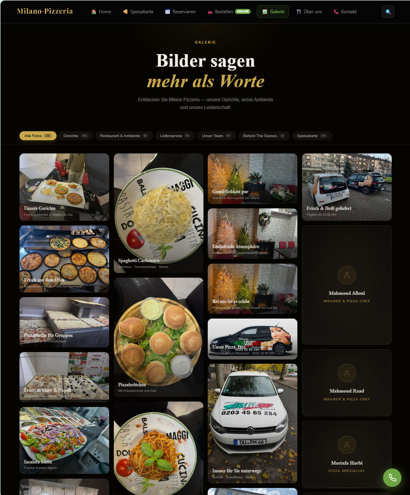

# 🍕 Milano Pizzeria

A modern restaurant website built with a focus on user experience, responsive design, and a clean online ordering workflow.

🌐 **Live Demo:** https://milano-pizzeria-duisburg.dev/

---

## 📸 Preview

> Screenshots will be added soon.

<!--



-->

---

## ✨ Features

- 🍕 Modern restaurant landing page
- 📱 Fully responsive design
- 🛒 Online ordering workflow
- 🍽️ Interactive menu
- 🖼️ Gallery section
- 📍 Contact & location
- ⚡ Fast loading
- 🎨 Clean UI/UX
- 🌙 Dark modern design

---

## 🛠 Tech Stack

<p align="left">

</p>

---

## 🚀 Live Website

https://milano-pizzeria-duisburg.dev/

---

## 📂 Project Structure

```
milano-pizzeria/
│
├── assets/
├── images/
├── css/
├── js/
├── components/
├── public/
└── index.html
```

---

## 🎯 Project Goals

- Build a professional restaurant website
- Deliver a modern user experience
- Improve accessibility and responsiveness
- Create a production-quality frontend project

---

## 📱 Responsive

The website is optimized for:

- Desktop
- Laptop
- Tablet
- Mobile

---

## 🔮 Future Improvements

- Backend integration
- Admin Dashboard
- Online payment
- Reservation system
- Customer accounts
- Multi-language support

---

## 👨‍💻 Author

**Mohamad Ali Choumar**

🌐 Portfolio  
https://choumar.is-a.dev

💼 LinkedIn  
https://www.linkedin.com/in/mohamad-ali-choumar-b425693a9/

🐙 GitHub  
https://github.com/MAliChoumar

---

## 📄 License

This project is licensed under the MIT License.
