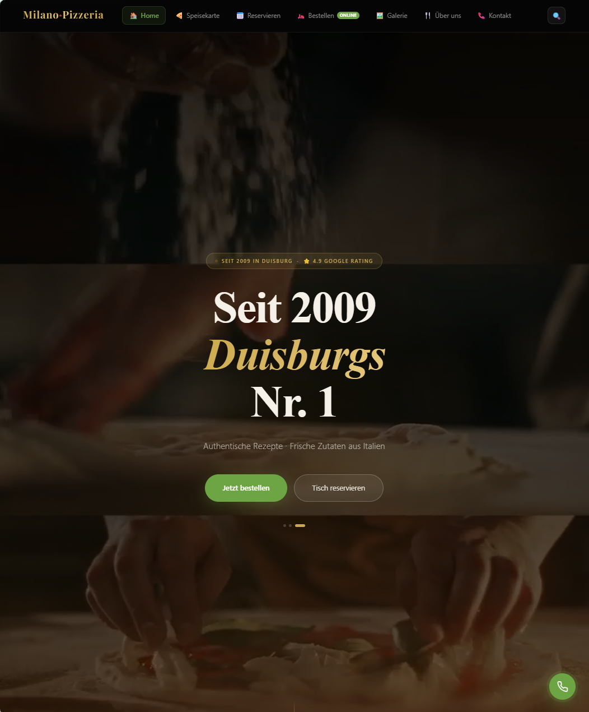
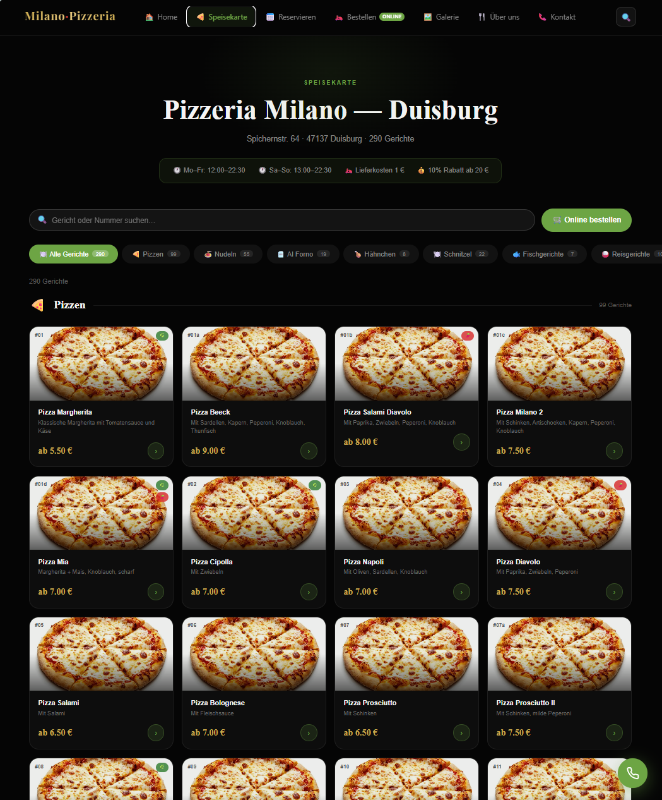
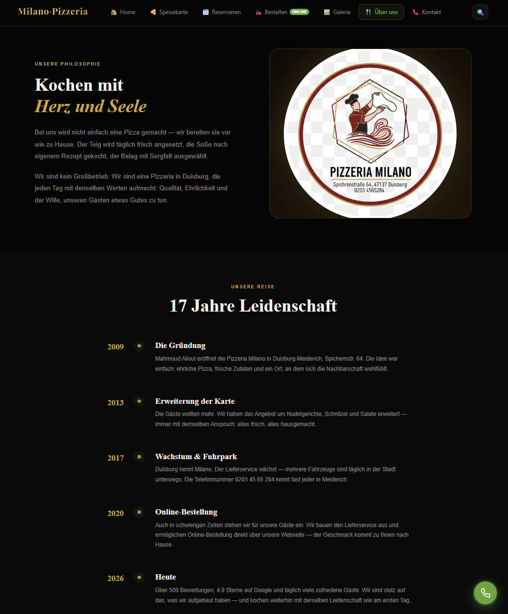
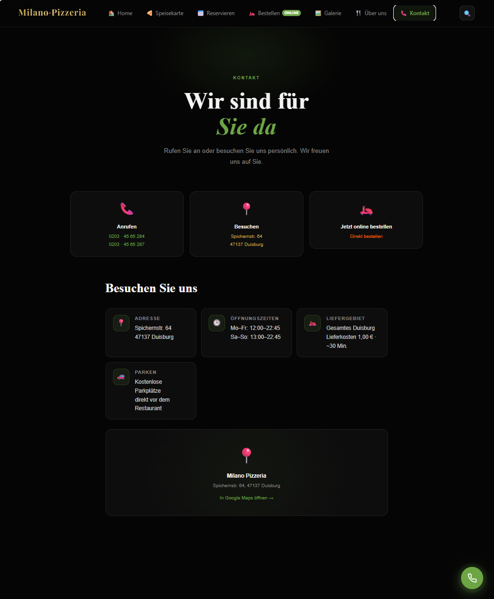

# 🍕 Milano Pizzeria Duisburg

Restaurant platform built and deployed for a business in Duisburg, Germany.
German-language, mobile-first, and running in production.

[](https://milano-pizzeria-duisburg.dev/)


🌐 **[milano-pizzeria-duisburg.dev →](https://milano-pizzeria-duisburg.dev/)**

---

## What it does

**Menu & gallery** — server-rendered German pages with image and video media,
built for phones first, since that is how guests actually browse a restaurant.

**Table reservation** — guests pick a date, time and party size on the site.
The request is then handed to WhatsApp pre-filled, so the guest only has to
press send. This was chosen over a full booking backend on purpose: the
restaurant has no staff to watch a dashboard, and the reservation needs to land
where they already work all day.

**Ordering** — the *Jetzt bestellen* button hands off to the restaurant's
existing legacy ordering site, which handles payment. **No payment is processed
by this application.**

**Legal pages** — Impressum and Datenschutz, as required for a commercial site
in Germany (TMG / DSGVO).

**Admin area** — JWT-protected dashboard listing reservations.

---

## Screenshots

| Home | Menu |
|:---:|:---:|
|  |  |

| Gallery | About |
|:---:|:---:|
|  |  |

<p align="center"></p>

---

## Stack

| Layer | Choice |
|---|---|
| Framework | Next.js 14 (App Router) |
| Language | TypeScript |
| Styling | Tailwind CSS |
| Database | PostgreSQL via Drizzle ORM |
| Motion | Framer Motion, GSAP |
| Hosting | Vercel (`fra1` — Frankfurt, closest region to the customers) |

---

## Engineering notes

- **Security headers** are set at the edge in `vercel.json`:
  `X-Frame-Options: DENY`, `X-Content-Type-Options: nosniff`,
  `Referrer-Policy: strict-origin-when-cross-origin`, and a `Permissions-Policy`
  that denies camera, microphone and geolocation.
- **No secret has a fallback value.** A build missing `JWT_SECRET` or
  `ADMIN_PASSWORD` denies every login instead of quietly accepting a default
  that anyone reading this repository could see.
- The admin session cookie is `httpOnly`, and `secure` in production.
- Nothing that could identify a session is written to the server log.

### Known limitations

Listed because they are real, not because they are finished work:

- The admin token is kept in `localStorage`, which is readable by any XSS on the
  page. Moving to cookie-only auth is the correct fix and has not been done.
- Stripe and PayPal scaffolding exists under `lib/utils/` and `app/api/`, left
  over from an earlier plan. It is not wired to any UI, because payment happens
  on the legacy site. It should be removed rather than left to rot.
- `@supabase/supabase-js` is still in `package.json` after the reservation flow
  was rewritten around WhatsApp. It is unused.

---

## Running locally

```bash
npm install
cp .env.example .env.local    # fill in real values
npm run db:migrate
npm run dev
```

Requires PostgreSQL. Every variable the app reads is listed in `.env.example`.

```bash
npm run type-check    # tsc --noEmit
npm run lint
npm run build
```

Seeding admin users requires `SEED_ADMIN_PASSWORD` to be set; the script refuses
to run without it.

---

## Author

**Mohamad Ali Choumar** — Software Engineering student, University of Duisburg-Essen

[Portfolio](https://choumar.is-a.dev) · [LinkedIn](https://www.linkedin.com/in/mohamad-ali-choumar-b425693a9/) · [GitHub](https://github.com/MAliChoumar)

## License

MIT
